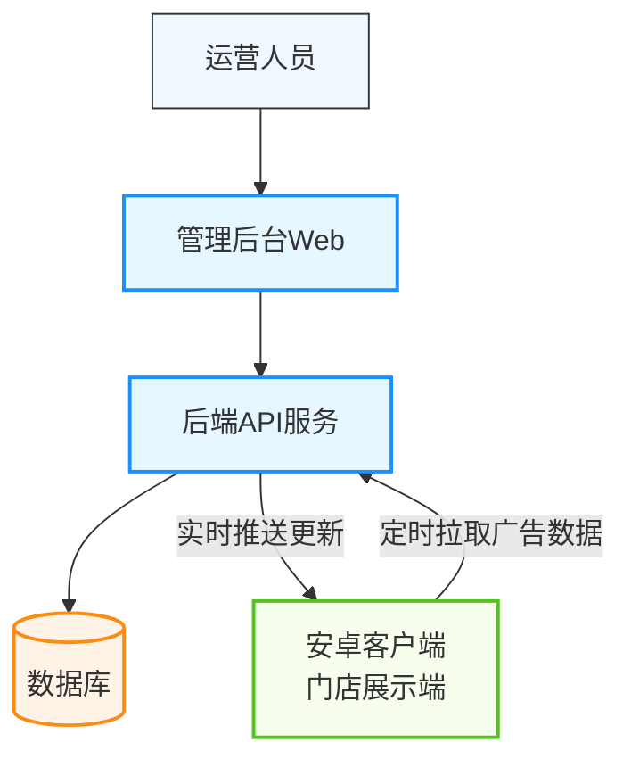

# 信发系统 产品需求文档

**文档版本**: v1.2
**创建日期**: 2026-04-08
**最后更新**: 2026-04-20
**项目名称**: 信发系统（门店广告投放展示系统）
**作者**: 马赛

---

## 目录

1. [项目概述](#1-项目概述)
2. [业务目标](#2-业务目标)
3. [系统架构](#3-系统架构)
4. [管理后台功能需求](#4-管理后台功能需求)
5. [安卓客户端功能需求](#5-安卓客户端功能需求)
6. [非功能性需求](#6-非功能性需求)
7. [数据需求](#7-数据需求)
8. [兼容性要求](#8-兼容性要求)
9. [权限设计](#9-权限设计)
10. [后续迭代规划](#10-后续迭代规划)

---

## 1. 项目概述

信发系统是一套面向连锁门店的广告信息发布系统，由**Web管理后台**和**安卓客户端**两大部分组成：

- **管理后台**供运营人员进行：门店管理、设备管理、素材上传管理、广告节目编排、广告分发投放
- **安卓客户端**安装在门店的展示设备上，根据管理后台配置自动拉取广告节目，并按照设备的屏幕配置进行分屏展示

## 2. 业务目标

| 目标 | 说明 |
|------|------|
| 统一管理 | 集中管理多门店多设备的广告内容 |
| 分屏展示 | 支持多种分屏布局展示不同广告内容 |
| 定时生效 | 支持设置广告投放的起止时间 |
| 远程更新 | 客户端自动拉取最新广告内容，无需人工现场更新 |
| 运行稳定 | 客户端长时间稳定运行，支持开机自启动 |

---

## 3. 系统架构



**组件说明**:

| 组件 | 职责 |
|------|------|
| 管理后台Web | 提供可视化操作界面，供运营人员完成所有管理功能，支持主动推送 |
| 后端API服务 | 处理业务逻辑，数据存储，提供接口供前后端调用，维护推送连接 |
| 数据库 | 存储门店、设备、素材、节目、分发等业务数据 |
| 安卓客户端 | 安装在门店硬件设备，拉取广告并按分屏展示，接收实时推送 |

---

## 4. 管理后台功能需求

### 4.1 整体菜单结构

根据参考截图，管理后台包含以下一级功能菜单：

1. 门店管理
2. 设备管理
3. 节目制作
4. 发布管理
5. 系统管理
   - 管理员账号管理
   - 角色管理
   - 菜单管理
   - 操作日志

### 4.2 门店管理

**功能说明**: 管理所有门店信息，每个门店下可以挂载多个展示设备。

**功能列表**:

| 功能项 | 需求说明 |
|--------|----------|
| 门店列表展示 | 分页展示所有门店，支持按门店名称/编码搜索 |
| 新增门店 | 弹窗录入门店信息，包含：<br/>- 门店名称（必填）<br/>- 门店编码（必填，唯一标识）<br/>- 地址（可选）<br/>- 联系人（可选）<br/>- 联系电话（可选）<br/>- 状态：启用/禁用 |
| 编辑门店 | 支持修改所有门店信息 |
| 删除门店 | 只有当门店下没有挂载设备时才能删除，否则提示无法删除 |
| 状态控制 | 禁用的门店下所有设备无法接收新广告 |

**原型参考**: [门店列表](design/store-list.html)、[编辑门店](design/store-edit.html)

### 4.3 设备管理

**功能说明**: 管理门店下的展示设备，每个设备需要配置屏幕方向和分屏类型。

**功能列表**:

| 功能项 | 需求说明 |
|--------|----------|
| 设备列表展示 | 分页展示所有设备，支持按名称/编码搜索，支持按门店筛选，列表显示备注信息 |
| 新增设备 | 弹窗录入：<br/>- 所属门店（可选，选择已有门店，可为空）<br/>- 设备名称（必填）<br/>- 设备编码（必填，唯一标识，客户端用此标识拉取数据）<br/>- 屏幕方向：横屏/竖屏<br/>- **屏幕分辨率**：（必填）下拉选择常见分辨率，支持用户新增自定义分辨率<br/>- 分屏类型：根据屏幕方向动态提供可选值<br/>  - 竖屏：1分屏、2分屏、3分屏<br/>  - 横屏：1分屏、2分屏、3分屏、3-1分屏、4分屏<br/>- **备注**（可选，记录设备故障信息或其他说明）<br/>- 状态：启用/禁用 |
| **Excel导入批量新增** | 支持上传Excel文件批量导入设备数据，模板下载功能，导入结果反馈（成功数量/失败原因） |
| 编辑设备 | 支持修改所有设备信息，包括门店、分辨率、备注等 |
| 删除设备 | 可直接删除设备 |
| 展示在线状态 | 在列表中显示设备最后活跃时间 |

**原型参考**: [设备列表](design/device-list.html)、[编辑设备](design/device-edit.html)

**分屏类型定义**:

**竖屏支持的分屏类型**:
| 类型 | 布局说明 |
|------|----------|
| 1分屏 | 全屏一个区域 |
| 2分屏 | 上下两个相等区域 |
| 3分屏 | 上中下三个相等区域 |

**横屏支持的分屏类型**:
| 类型 | 布局说明 |
|------|----------|
| 1分屏 | 全屏一个区域 |
| 2分屏 | 左右两个相等区域 |
| 3分屏 | 左中右三个相等区域 |
| 3-1分屏 | 左侧占1/2，右侧上下两个各占1/4 |
| 4分屏 | 田字格四个相等区域 |

### 4.4 素材管理

**功能说明**: 管理广告素材，支持上传图片和视频，供节目编排使用。

**功能列表**:

| 功能项 | 需求说明 |
|--------|----------|
| 素材列表展示 | 分页展示，支持按名称搜索，按类型（图片/视频）筛选 |
| 素材上传 | 支持上传单个素材：<br/>- 支持格式：图片 JPG/PNG/GIF，视频 MP4/AVI/MOV<br/>- 单文件最大限制：100MB<br/>- 上传后自动生成访问URL |
| 素材预览 | 图片素材支持弹窗预览，视频不预览但保留URL |
| 删除素材 | 可删除素材，删除后无法在节目中使用 |

**原型参考**: [素材管理](design/material.html)

### 4.5 节目制作

**功能说明**: 编排广告节目，将素材按照分屏区域组合编排成一个可发布的广告节目。

**功能列表**:

| 功能项 | 需求说明 |
|--------|----------|
| 节目列表展示 | 分页展示，支持按名称搜索，按状态（草稿/已发布）筛选 |
| 新建节目 | 配置：<br/>- 节目名称（必填）<br/>- 适配屏幕方向：横屏/竖屏/任意<br/>- 适配分屏类型：1/2/3/3-1/4/任意<br/>- 按区域添加素材 |
| 区域编排 | 根据选择的分屏类型，自动生成对应数量的区域框，运营人员可为每个区域添加多个素材：<br/>- 一个区域内多个素材轮播展示<br/>- 可移除已添加素材<br/>- 每个素材展示时长默认为5秒，可配置（后期扩展） |
| 保存草稿 | 未完成的节目可以保存为草稿，不允许发布 |
| 保存并发布 | 保存并标记为已发布，发布后才可进行分发投放 |
| 编辑节目 | 支持修改所有配置 |
| 删除节目 | 如果节目已经在发布计划中，提示无法删除 |

**原型参考**: [节目列表](design/program-list.html)、[编辑节目](design/program-edit.html)

### 4.6 发布管理（分发）

**功能说明**: 将已发布的节目分发投放到指定门店，支持设置生效时间范围。

**功能列表**:

| 功能项 | 需求说明 |
|--------|----------|
| 发布列表展示 | 分页展示所有发布计划，支持按节目名称搜索，按状态（启用/停用）筛选，支持批量选择 |
| 新建发布计划 | 配置：<br/>- 选择节目（只能选择已发布节目）<br/>- **只支持按门店发布**：选择目标门店（可多选），发布后该门店下所有设备都会接收到此广告节目<br/>- 设置生效开始时间<br/>- 设置生效结束时间（可选，不填表示永久生效）<br/>- **播放周期**：选择周一至周日，支持多选，广告只在选中的日期播放 |
| 启用/停用 | 可以随时停用某个发布计划，停用后设备不再播放该节目 |
| 删除发布计划 | 可以删除发布计划 |
| **立即推送** | 支持对单个发布计划进行手动推送，将最新广告节目立即推送到目标门店的所有设备，使广告立即生效，无需等待客户端定时拉取 |
| **批量推送** | 支持批量选择多个发布计划，一键批量推送到对应目标设备 |

**原型参考**: [发布计划列表](design/publish.html)、[新建发布计划弹窗](design/new-publish-plan.html)

### 4.7 管理员账号管理

**功能说明**: 管理后台管理员账号，每个管理员账号需要关联一个角色，登录后只能访问角色授权范围内的菜单。

**功能列表**:

| 功能项 | 需求说明 |
|--------|----------|
| 管理员列表 | 展示所有后台管理员账号，列表显示关联的角色 |
| 新增管理员 | 支持新增，设置：<br/>- 用户名（必填，唯一）<br/>- 登录密码（必填）<br/>- 姓名（必填）<br/>- **关联角色**（必填，从已创建的角色列表中选择一个）<br/>- 状态：启用/禁用 |
| 编辑管理员 | 支持修改姓名、关联角色、状态，不支持查看原密码 |
| 修改密码 | 支持修改密码，需要输入原密码验证 |
| 重置密码 | 超级管理员可以重置其他管理员密码 |
| 禁用账号 | 支持禁用账号，禁用后无法登录 |

**原型参考**: [管理员账号管理](design/admin-list.html)

### 4.8 操作日志

**功能说明**: 记录系统管理员的关键操作，便于问题追溯和审计。

**功能列表**:

| 功能项 | 需求说明 |
|--------|----------|
| 日志列表展示 | 分页展示所有操作日志，支持按操作人员、操作类型、时间范围筛选 |
| 需要记录的操作 | - 用户登录成功、用户登出<br/>- 新建发布计划、编辑发布计划、启用/停用发布计划、删除发布计划、推送发布计划<br/>- 批量推送发布计划<br/>- 门店：新增、编辑、删除<br/>- 设备：新增、编辑、删除、批量导入<br/>- 节目：新建、编辑、删除<br/>- 管理员：新增、编辑、禁用/启用 |
| 日志字段 | 操作人账号、操作类型、操作对象、操作内容、IP地址、操作时间 |
| 删除日志 | 不支持手动删除日志，系统自动留存 |

**原型参考**: [操作日志](design/operation-log.html)

### 4.9 菜单管理

**功能说明**: 管理系统所有菜单权限，配置菜单的层级结构，用于角色权限分配。

**功能列表**:

| 功能项 | 需求说明 |
|--------|----------|
| 菜单列表展示 | 按树形结构展示所有菜单，显示菜单名称、路由路径、排序、状态 |
| 新增菜单 | 支持新增菜单，配置：<br/>- 菜单名称（必填）<br/>- 上级菜单（可选，顶级菜单留空）<br/>- 路由路径（必填，唯一标识）<br/>- 排序号（用于控制菜单显示顺序）<br/>- 状态：启用/禁用 |
| 编辑菜单 | 支持修改所有菜单配置 |
| 删除菜单 | 只有无子菜单的菜单才能删除，删除后角色关联的授权也同步移除 |

**菜单层级说明**:
- 支持两级菜单结构：一级菜单（对应导航栏菜单）、二级菜单（对应一级菜单下的子菜单）
- 一级菜单展示在左侧导航栏，二级菜单收纳在一级菜单下

**原型参考**: [菜单管理](design/menu-list.html)

### 4.10 角色管理

**功能说明**: 通过角色对菜单权限进行分组管理，为角色勾选可访问的菜单权限，管理员账号关联角色后继承角色的菜单权限。

**功能列表**:

| 功能项 | 需求说明 |
|--------|----------|
| 角色列表展示 | 分页展示所有角色，显示角色名称、备注、状态 |
| 新增角色 | 支持新增角色，配置：<br/>- 角色名称（必填，唯一）<br/>- 备注（可选，说明角色职责）<br/>- **菜单权限勾选**（树形结构展示所有菜单，支持全选/反选，勾选该角色可访问的菜单）<br/>- 状态：启用/禁用 |
| 编辑角色 | 支持修改角色名称、备注、状态、重新勾选菜单权限 |
| 删除角色 | 只有未关联任何管理员账号的角色才能删除，否则提示无法删除 |
| 复制角色 | 支持复制已有角色的菜单权限，快速创建新角色 |

**权限控制规则**:
- 超级管理员角色默认拥有所有菜单权限，不需要勾选
- 禁用的角色，其关联的所有管理员账号都无法登录系统
- 管理员登录后，左侧导航栏只展示其角色有权限访问的菜单

**原型参考**: [角色列表](design/role-list.html)、[编辑角色](design/role-edit.html)

### 4.11 登录功能

**功能说明**:

- 管理员通过用户名密码登录
- 登录成功后保存token，24小时有效
-  token过期后需要重新登录
- 根据管理员关联的角色权限，只显示有权限访问的菜单

### 4.12 多语言支持

**功能说明**: 管理后台支持多语言切换，满足不同地区使用需求。

**功能列表**:

| 功能项 | 需求说明 |
|--------|----------|
| 支持语言 | 支持三种语言：**日语**、**中文简体**、**英语** |
| 默认语言 | 系统默认语言为**日语** |
| 语言切换 | 在页面右上角提供语言切换入口，点击可切换显示语言 |
| 语言记忆 | 切换后记住用户选择，下次登录保持上次选择 |
| 翻译范围 | 所有菜单、按钮、表单标签、提示信息等界面文字都需要支持多语言 |

---

## 5. 安卓客户端功能需求

### 5.1 核心功能

| 功能项 | 需求说明 |
|--------|----------|
| 设备标识 | 通过设备编码识别设备，设备编码需要和管理后台录入的一致（可在设置界面配置） |
| 自动拉取 | 定时（建议每5分钟）向服务器请求当前应该播放的节目，服务端根据当前日期的星期和配置的播放周期筛选出需要播放的节目 |
| **实时推送接收** | 保持与服务端的长连接，接收管理端主动推送的广告更新通知，收到推送后立即拉取最新广告数据并刷新播放，使新广告立即生效 |
| 布局适配 | 根据设备配置的**屏幕方向**和**分屏类型**，自动渲染对应的布局容器 |
| 区域播放 | 每个区域独立播放：<br/>- 单素材：如果只有一个视频则循环播放，如果是一张图片就一直显示<br/>- 多素材：按顺序轮播，每个素材展示指定时长后切换到下一个 |
| 图片支持 | 支持展示JPG/PNG/GIF格式图片 |
| 视频支持 | 支持播放MP4格式视频，视频播放完成后自动切换下一个素材 |
| 缓存机制 | 对已拉取的素材进行本地缓存，避免重复下载 |
| 异常处理 | 网络异常时继续播放已有节目，不黑屏，网络恢复后自动重连推送通道 |

### 5.2 分屏布局要求

客户端根据设备配置的**屏幕方向**（竖向/横向）支持不同的分屏布局，每种布局要严格按比例分割屏幕：

---

#### 竖向屏幕支持的布局

**1分屏**:
```
┌───────────────┐
│               │
│   region 1    │
│               │
│               │
└───────────────┘
```

**2分屏（上下两个相等区域）**:
```
┌───────────────┐
│   region 1    │
├───────────────┤
│   region 2    │
└───────────────┘
```

**3分屏（上中下三个相等区域）**:
```
┌───────────────┐
│   region 1    │
├───────────────┤
│   region 2    │
├───────────────┤
│   region 3    │
└───────────────┘
```

---

#### 横向屏幕支持的布局

**1分屏**:
```
┌─────────────────────────┐
│                         │
│                         │
│       region 1          │
│                         │
│                         │
└─────────────────────────┘
```

**2分屏（左右两个相等区域）**:
```
┌───────────┬───────────┐
│           │           │
│           │           │
│  region1  │  region2  │
│           │           │
│           │           │
└───────────┴───────────┘
```

**3分屏（左中右三个相等区域）**:
```
┌───────┬───────┬───────┐
│       │       │       │
│       │       │       │
│ reg1  │ reg2  │ reg3  │
│       │       │       │
│       │       │       │
└───────┴───────┴───────┘
```

**3-1分屏（左侧占1/2，右侧上下两个各占1/4）**:
```
┌───────────┬───────┐
│           │ reg2  │
│           ├───────┤
│  region1  │ reg3  │
│           │       │
│           │       │
└───────────┴───────┘
```

**4分屏（田字格四个相等区域）**:
```
┌───────┬───────┐
│ reg1  │ reg2  │
├───────┼───────┤
│ reg3  │ reg4  │
└───────┴───────┘
```

### 5.3 系统功能

| 功能项 | 需求说明 |
|--------|----------|
| 全屏显示 | 应用启动后全屏展示，隐藏状态栏和导航栏 |
| 屏幕常亮 | 保持屏幕一直唤醒，不锁屏 |
| 开机自启动 | 设备开机后自动启动应用 |
| 设备配置 | 提供设置页面，允许现场配置设备编码和服务器地址 |
| 版本升级 | 支持APK在线升级（后期版本迭代可做） |

---

## 6. 非功能性需求

### 6.1 性能需求

- 管理后台页面响应时间 < 2秒
- 后端API接口响应时间 < 500ms
- 安卓客户端启动时间 < 10秒
- 支持至少1000家门店，5000台设备规模

### 6.2 安全性需求

- 管理后台必须登录才能访问
- 密码加密存储
- 客户端仅允许拉取数据，不允许修改服务端数据
- 文件上传需要做类型校验，防止上传恶意文件
- 接口访问需要进行权限校验，未授权无法访问接口

### 6.3 可用性需求

- 安卓客户端需要7*24小时稳定运行
- 管理后台支持多管理员同时操作
- 服务端需要有日志记录，便于排查问题

---

## 7. 数据需求

### 7.1 核心实体

| 实体 | 关键字段 |
|------|----------|
| 门店 | 名称、编码、地址、联系人、电话、状态 |
| 设备 | 所属门店（可为空）、名称、编码、屏幕方向、屏幕分辨率、分屏类型、备注、状态、最后活跃时间 |
| 素材 | 名称、类型（图片/视频）、URL、文件大小、上传时间 |
| 节目 | 名称、适配屏幕方向、适配分屏类型、区域素材配置、状态（草稿/已发布） |
| 发布计划 | 节目、目标门店ID列表、开始时间、结束时间、播放周期（周一至周日多选）、状态、最后推送时间 |
| 菜单 | 菜单名称、上级菜单ID、路由路径、排序号、状态 |
| 角色 | 角色名称、备注、状态、菜单权限ID列表（授权可访问的菜单） |
| 管理员 | 用户名、密码哈希、姓名、**角色ID**（关联一个角色）、状态 |
| 操作日志 | 操作人账号、操作类型、操作对象、操作内容、IP地址、操作时间 |

### 7.2 业务规则

1. 门店编码唯一，设备编码唯一
2. 只有已发布的节目才能创建发布计划
3. 已关联到发布计划的节目不能删除
4. 有设备的门店不能删除
5. 客户端拉取节目时，只返回当前日期星期在播放周期内且在时间范围内的生效发布计划
6. 客户端拉取节目时，优先返回最新创建的生效发布计划

---

## 8. 兼容性要求

### 8.1 管理后台

- 支持主流现代浏览器：Chrome、Edge、Firefox、Safari
- 适配主流分辨率：1920×1080 及以上

### 8.2 安卓客户端

- 支持 Android 8.0 (API level 24) 及以上版本
- 支持横屏和竖屏展示
- 适配常见广告屏分辨率：1920×1080、3840×2160等

---

## 9. 权限设计

### 9.1 权限模型

采用**RBAC（基于角色的访问控制）**模型：

- **菜单**：系统中所有可访问的功能页面，支持两级层级结构
- **角色**：对一组菜单权限的集合，例如超级管理员、运营管理员、查看员等
- **管理员**：每个管理员账号关联一个角色，继承角色拥有的菜单权限
- **权限控制**：前端根据权限过滤显示菜单，后端接口对每个请求进行权限校验

### 9.2 默认角色

系统初始化时自动创建一个**超级管理员**角色：
- 自动拥有全部菜单权限
- 不支持删除
- 不支持修改权限配置

---

## 10. 后续迭代规划

| 版本 | 功能规划 |
|------|----------|
| v1.x | 完成全部基础功能：门店管理、设备管理（含Excel批量导入）、素材管理、节目制作、发布管理（含实时推送）、RBAC权限体系（菜单管理/角色管理/管理员权限控制）、操作日志、多语言支持（日语/中文简体/英语） |
| v2.x | 增加设备在线状态监控、素材展示时长可配置、播放数据统计、节目优先级设置、日程轮播（支持不同时段播放不同节目）、APK在线升级、素材标签分类管理 |

---

## 版本历史

| 版本 | 日期 | 修改内容 | 作者 |
|------|------|----------|------|
| v1.0 | 2026-04-08 | 初始版本发布 | 马赛 |
| v1.1 | 2026-04-14 | 1. 新增设备时所属门店允许为空；<br/>2. 新增Excel导入批量新增设备功能；<br/>3. 新增屏幕分辨率字段，下拉选择支持自定义新增；<br/>4. 新增备注字段，列表页展示备注；<br/>5. 发布管理调整为只支持发布到门店，移除按设备发布；<br/>6. 新增操作日志功能，记录用户登录登出、发布管理变更等操作；<br/>7. 新增实时推送功能：管理端支持单个/批量推送发布计划；<br/>8. 安卓客户端支持接收推送通知，立即更新广告节目使其立即生效 | 马赛 |
| v1.2 | 2026-04-20 | 1. 新增菜单管理：管理系统所有菜单，支持树形结构展示、新增编辑删除；<br/>2. 新增角色管理：创建角色并为角色勾选授权可访问的菜单；<br/>3. 调整管理员账号管理：每个管理员必须关联一个角色，登录后只展示有权限的菜单；<br/>4. 新增接口权限校验，未授权无法访问；<br/>5. 调整菜单结构，将相关功能归类到系统管理下；<br/>**6. 新增多语言支持：管理后台支持日语、中文简体、英语三种语言切换，默认语言为日语，所有界面文字都支持翻译** | 马赛 |

---

## 附录

### 交互原型链接

| 原型文件 | 对应功能 |
|--------|----------|
| [store-list.html](design/store-list.html) | 门店管理列表页 |
| [store-edit.html](design/store-edit.html) | 新增/编辑门店弹窗 |
| [device-list.html](design/device-list.html) | 设备管理列表页 |
| [device-edit.html](design/device-edit.html) | 新增/编辑设备弹窗 |
| [program-list.html](design/program-list.html) | 节目列表页 |
| [program-edit.html](design/program-edit.html) | 新增/编辑节目弹窗 |
| [material.html](design/material.html) | 素材管理页面 |
| [publish.html](design/publish.html) | 发布计划列表页 |
| [new-publish-plan.html](design/new-publish-plan.html) | 新建发布计划弹窗 |
| [admin-list.html](design/admin-list.html) | 管理员账号管理页面 |
| [operation-log.html](design/operation-log.html) | 操作日志列表页 |
| [menu-list.html](design/menu-list.html) | 菜单管理页面 |
| [role-list.html](design/role-list.html) | 角色管理列表页 |
| [role-edit.html](design/role-edit.html) | 新增/编辑角色弹窗（含菜单权限勾选） |

### 安卓竖屏客户端分屏布局原型

| 原型文件 | 布局类型 |
|--------|----------|
| [android-portrait-1split.html](design/android-portrait-1split.html) | 竖屏1分屏 |
| [android-portrait-2split.html](design/android-portrait-2split.html) | 竖屏2分屏（上下） |
| [android-portrait-3split.html](design/android-portrait-3split.html) | 竖屏3分屏（上中下） |

### 平板横屏客户端分屏布局原型

| 原型文件 | 布局类型 |
|--------|----------|
| [tablet-landscape-1split.html](design/tablet-landscape-1split.html) | 横屏1分屏 |
| [tablet-landscape-2split.html](design/tablet-landscape-2split.html) | 横屏2分屏（左右） |
| [tablet-landscape-3split.html](design/tablet-landscape-3split.html) | 横屏3分屏（左中右） |
| [tablet-landscape-3-1split.html](design/tablet-landscape-3-1split.html) | 横屏3-1分屏 |
| [tablet-landscape-4split.html](design/tablet-landscape-4split.html) | 横屏4分屏（田字格） |

---

**文档结束**
